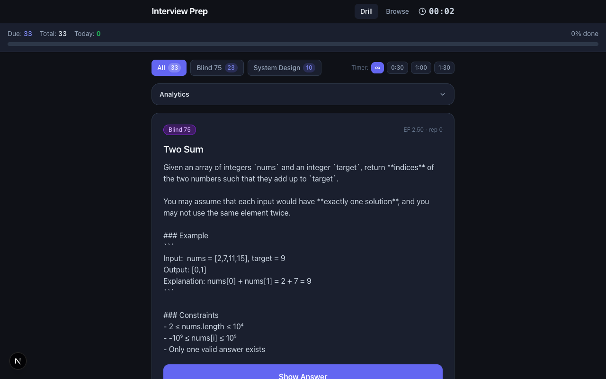

# Interview Prep Drill

Spaced-repetition drill for Blind 75 algorithm problems and system design — web UI + Discord bot. The bot picks the next due card via SM-2, asks it in a `#drill` channel, and grades your written answer.



## Features

- **SM-2 scheduler** — canonical spaced repetition; intervals adapt to your grade (0–5)
- **Two decks** — Blind 75 (algorithm problems) and System Design flashcards; queue mixes both by due date
- **Web UI** — dark-mode drill interface with timer presets (∞ / 0:30 / 1:00 / 1:30), deck filter, progress bar
- **Browse mode** — scan all cards, filter by deck, see EF and rep counts
- **Discord bot** — OpenClaw subagent owns the `#drill` channel; delivers cards, grades answers, updates SM-2 state automatically

## Stack

- **Next.js** + TypeScript + Tailwind
- **better-sqlite3** — cards, SM-2 state, review log (`~/.openclaw/interview-prep-drill/cards.db`, WAL mode)
- **OpenClaw** — Discord channel binding for the bot persona

## Running locally

```bash
npm install
npm run dev
```

Open [http://localhost:3003](http://localhost:3003).

## Data model

| Table | Purpose |
|---|---|
| `cards` | id, deck, title, body_md |
| `card_state` | EF, interval, reps, due_at per card |
| `reviews` | append-only log of every grade |

Card bodies live in user-editable markdown under `problems/` (Blind 75) and `flashcards/` (system design). Body text is mirrored into `cards.body_md` so the bot never reads disk during a live drill.

## SM-2 algorithm

```ts
review(state, quality /* 0..5 */, now?) -> CardState
```

- EF init `2.5`, floor `1.3`
- `q < 3` resets reps to 0 and interval to 1 day; EF still decrements
- `q >= 3`: reps 0 → 1 day, reps 1 → 6 days, otherwise `round(prevInterval × EF')`

## Seeding

```bash
npx tsx scripts/seed.ts      # load problems/ and flashcards/ into the db
npx tsx scripts/smoke.ts     # sanity: open db, insert card, grade q=4
```
